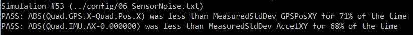
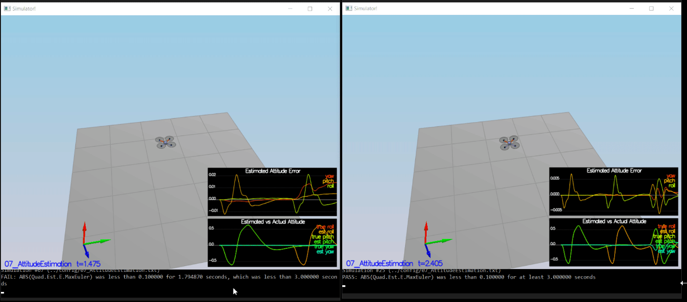
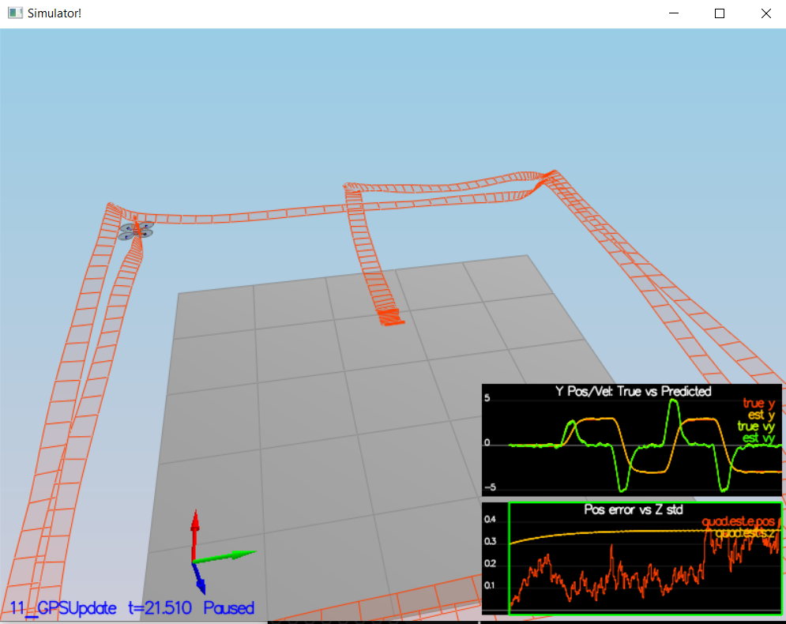
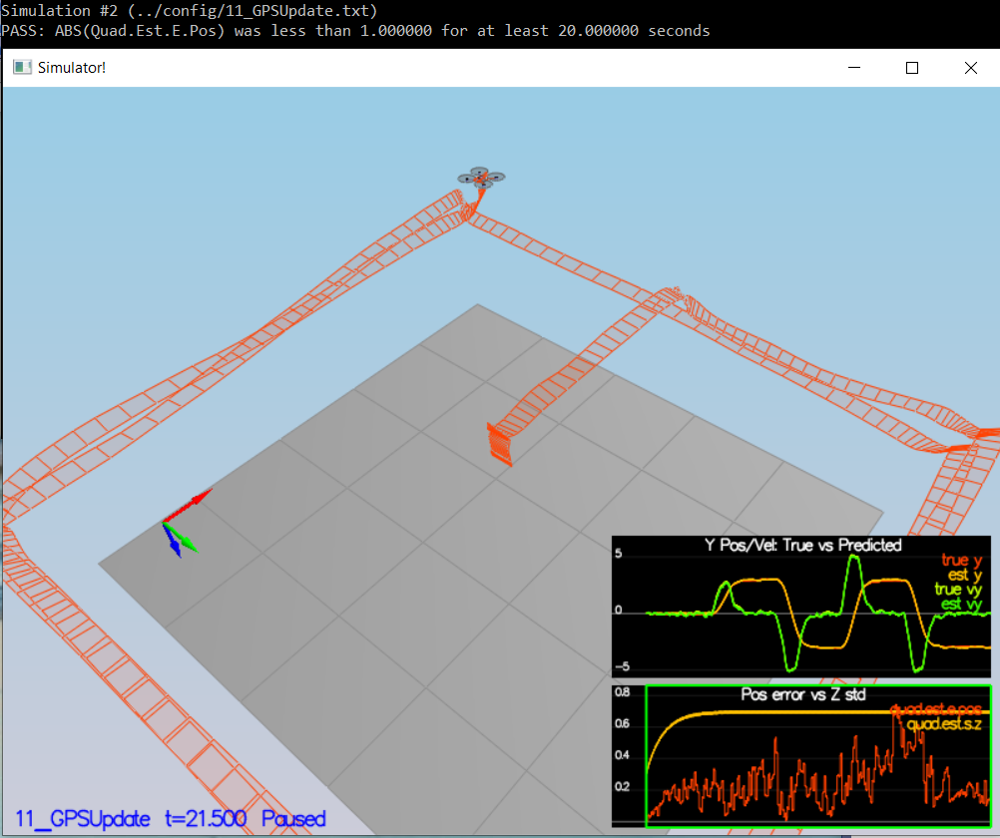

# Project: <ins>FCND-Estimation-CPP</ins>

***
## All Required Steps for a Passing Submission have been completed:

1. The Writeup is created. 
2. The Estimator has been Implemented.
3. My C++ Estimator implementation meets the performance criteria of each step.

***
## [Rubric Points](https://review.udacity.com/#!/rubrics/1807/view) 
 Here I will consider the rubric points individually and describe how I addressed each point in my implementation.  

___
### 1. Writeup / README

_Provide a Writeup / README that includes all the rubric points and how you addressed each one._  

Current document is the **Writeup**

___
### 2. Implement Estimator   
#### Step 1: Sensor Noise 
   _Determine the standard deviation of the measurement noise of both GPS X data and Accelerometer X data._      
   By running the scenario 6 in the simulator, I have collected the GPS and Accelerometer data in to   
   `config/log/Graph1.txt` and `config/log/Graph2.txt` appropriately.  
   Using the MS Excell software I've gotten the following results :  
   `MeasuredStdDev_GPSPosXY = 0.71`   
   `MeasuredStdDev_AccelXY = 0.49`  
    The above configuration allow to pass the scenario 6  
<p align="left">

</p>
<p align="center">

</p>

___
#### Step 2: Attitude Estimation. 
Implement a better rate gyro attitude integration scheme in the UpdateFromIMU() function.
I've used `Quaternion` approach to complete this task. 
Also, I saw that the averaging `(lastGyro + gyro)/2` provides better results.
Here is a code snippet:
```code
  // float predictedPitch = pitchEst + dtIMU * gyro.y;
  // float predictedRoll = rollEst + dtIMU * gyro.x;
  // ekfState(6) = ekfState(6) + dtIMU * gyro.z;	// yaw
Quaternion<float> qt = Quaternion<float>::FromEuler123_RPY(rollEst , pitchEst, ekfState(6));
Quaternion<float>dq;
dq.IntegrateBodyRate((lastGyro + gyro)/2.0, dtIMU) ;
Quaternion<float> qt_bar = dq*qt;
float predictedPitch = qt_bar.Pitch();
float predictedRoll = qt_bar.Roll();
ekfState(6) = qt_bar.Yaw();
```
Below are two captures before and after fix: 
<p align="center">

</p>

___
#### Step 3: Prediction Step.
##### _Scenario:_ `08_PredictState`
Below is a snippet of the `PredictState()` implementation:   
```commandline
  ////////////////////////////// BEGIN STUDENT CODE ///////////////////////////

  V3F i_acc = attitude.Rotate_BtoI(accel);

  predictedState(0) += predictedState(3) * dt;
  predictedState(1) += predictedState(4) * dt;
  predictedState(2) += predictedState(5) * dt;


  predictedState(3) += i_acc.x * dt;
  predictedState(4) += i_acc.y * dt;
  predictedState(5) += (i_acc.z - 9.81f) * dt;

  /////////////////////////////// END STUDENT CODE ////////////////////////////
```

<p align="center">

</p>


##### _Scenario:_ `09_PredictionCov`
Snippet of the `GetRbgPrime()` implementation: 

```commandline
  ////////////////////////////// BEGIN STUDENT CODE ///////////////////////////
  RbgPrime(0, 0) = -cos(pitch) * sin(yaw);
    RbgPrime(0, 1) = -sin(roll) * sin(pitch) * sin(yaw) - cos(roll)*cos(yaw);
      RbgPrime(0, 2) = -cos(roll) * sin(pitch) * sin(yaw) + sin(roll) * cos(yaw);

  RbgPrime(1, 0) = cos(pitch) * cos(yaw);
    RbgPrime(1, 1) = sin(roll) * sin(pitch) * cos(yaw) - cos(roll) * sin(yaw);
      RbgPrime(1, 2) = cos(roll) * sin(pitch) * cos(yaw) + sin(roll) * sin(yaw);
  /////////////////////////////// END STUDENT CODE ////////////////////////////
```
Snippet of the `Predict()` implementation: 

```commandline
  ////////////////////////////// BEGIN STUDENT CODE ///////////////////////////
  // Complete the gPrime matrix
  gPrime(0, 3) = gPrime(1, 4) = gPrime(2, 5) = dt;
  gPrime(3, 6) = (RbgPrime(0, 0) * accel.x + RbgPrime(0, 1) * accel.y + RbgPrime(0, 2) * accel.z)*dt;
  gPrime(4, 6) = (RbgPrime(1, 0) * accel.x + RbgPrime(1, 1) * accel.y + RbgPrime(1, 2) * accel.z)*dt;
  gPrime(5, 6) = (RbgPrime(2, 0) * accel.x + RbgPrime(2, 1) * accel.y + RbgPrime(2, 2) * accel.z)*dt;
  
  MatrixXf newEkfCov(QUAD_EKF_NUM_STATES, QUAD_EKF_NUM_STATES);
  newEkfCov = gPrime * ekfCov * gPrime.transpose() + Q;
  
  ekfCov = newEkfCov;
  /////////////////////////////// END STUDENT CODE ////////////////////////////
```
Setting `QPosXYStd = .05` and  `QVelXYStd = .2` , I get the following results:

<p align="center">

</p>  

---
#### Step 4: Magnetometer Update.

Snippet of the `UpdateFromMag()` implementation: 

```commandline
  ////////////////////////////// BEGIN STUDENT CODE ///////////////////////////
  zFromX(0) = ekfState(6);

  // The difference between an estimated  `Yaw` and a measured `Yaw` 
  // can be around 2Pi, when crossing the + \ - Pi values.
  // Therefore a normalization is required.
  float z_error(zFromX(0) - z(0));
  if (z_error > F_PI) z_error -= 2.f * F_PI;
  if (z_error < -F_PI) z_error += 2.f * F_PI;
  z(0) = zFromX(0) - z_error;

  hPrime(QUAD_EKF_NUM_STATES-1) = 1.0;
  /////////////////////////////// END STUDENT CODE ////////////////////////////
```

<p align="center">

</p>

___

#### Step 5: Closed Loop + GPS Update.
`UpdateFromGPS()` implementation  snippet :
```commandline
  ////////////////////////////// BEGIN STUDENT CODE ///////////////////////////
  for (int i = 0; i < 6; i++) {
      hPrime(i, i) = 1.0;
      zFromX(i) = ekfState(i);
  }
  /////////////////////////////// END STUDENT CODE ////////////////////////////
```

Setting the `QPosZStd = 0.1` and `QVelZStd = 0.5` , the above code passes the `11_GPSUpdate` scenario.  

<p align="center">

</p>

---

#### Step 6: Adding Your Controller.
The replacing  the `QuadController.cpp`  and `QuadControlParams.txt` files  
without additional tuning has been lead to a crash.   
Reverting back the `Quad.UseIdealEstimator = 1` and touch the tuning parameters in `QuadControlParams.txt`  

```commandline
# Position control gains
kpPosXY = 2.5
kpPosZ = 30
KiPosZ = 500

# Velocity control gains
kpVelXY = 5
kpVelZ = 10

# Angle control gains
kpBank = 13
kpYaw = 2
```
The result is pretty stable. See the gif image below:

<p align="center">

</p>

In order to pass the scenario with `Quad.UseIdealEstimator = 1` additional round of tuning has been required.
Ultimately, using the following configuration I succeed to pass the last scenario.
```commandline
# Position control gains
kpPosXY = 2
kpPosZ = 2
KiPosZ = 10

# Velocity control gains
kpVelXY = 8
kpVelZ = 10

# Angle control gains
kpBank = 12
kpYaw = 2
```

<p align="center">

</p>

## Summery 
- All required tasks has been completed and pass the tests.
- The controller from last project has been successfully integrated. 
- De-tuning has been done and allows to pass the test.
